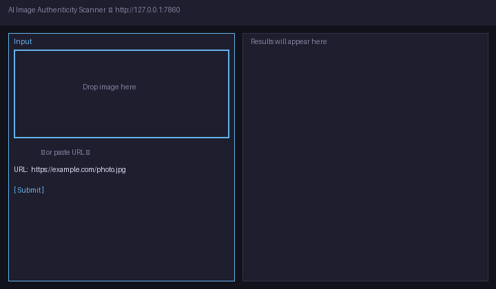

# AI Image Authenticity Scanner

> Detect AI-generated images via ensemble of CLIP embeddings, DCT frequency analysis, and a pre-trained HuggingFace classifier.



## What it is

A locally-runnable REST API and Gradio UI that scores any image — by file upload or URL — on the probability that it was AI-generated. Rather than wrapping a single model, it combines three orthogonal signals: frequency-domain artifact detection (real camera sensors leave characteristic high-frequency noise; diffusion models leave grid-like DCT artifacts), cosine distance of CLIP embeddings from a calibration centroid built on real photographs, and a pre-trained `Organika/sdxl-detector` classifier from HuggingFace.

The three signals are merged by a weighted average (weights tunable in `config.py`) into a single 0–1 confidence score. Every response includes a per-signal breakdown so the verdict is always explainable. No external API calls are made after installation — calibration files ship with the repo.

## Quickstart

```bash
git clone https://github.com/RitikPatill/ai-image-authenticity-scanner.git
cd ai-image-authenticity-scanner

# Install dependencies (Python 3.10+, ~2 GB disk for torch + CLIP weights)
pip install -r requirements.txt && pip install -e .

# One-time: build CLIP calibration centroids (~350 MB download, then offline)
python scripts/build_clip_calibration.py

# Launch the Gradio UI
python app.py
# → Open http://127.0.0.1:7860
```

> **Apple Silicon:** install PyTorch separately before the pip step:
> ```bash
> pip install torch torchvision --index-url https://download.pytorch.org/whl/cpu
> ```

## Usage

**Gradio UI** — open `http://127.0.0.1:7860`, drag-and-drop an image or paste a public URL, and click Submit. The interface shows the ensemble score, a gauge, per-signal bar chart, and the raw JSON response.

**REST API** — start the server with `uvicorn ai_image_scanner.api:app --reload`, then:

```bash
# Score by file upload
curl -X POST http://localhost:8000/detect -F "file=@photo.jpg"

# Score by URL
curl "http://localhost:8000/detect?url=https://example.com/image.png"
```

Both endpoints return the same JSON schema — `score` (0–1), `verdict` (`"AI"` or `"REAL"`), `signals` (per-detector scores), and `processing_time_ms`.

**Batch CLI** — score a folder and write a CSV report:

```bash
python -m ai_image_scanner.cli.batch ./images --output results.csv
```

**Tests:**

```bash
pytest tests/test_api.py tests/test_app.py -v   # fast — all detectors mocked
pytest tests/ -v                                # full suite (downloads CLIP on first run)
```

## Architecture

```
          ┌─────────────────────────────┐
          │  Input: file upload / URL   │
          │  Gradio UI · REST API · CLI │
          └──────────────┬──────────────┘
                         │
         ┌───────────────┼───────────────┐
         ▼               ▼               ▼
  ┌─────────────┐ ┌─────────────┐ ┌─────────────┐
  │  Frequency  │ │    CLIP     │ │     HF      │
  │  Detector   │ │    Drift    │ │ Classifier  │
  │  (DCT/FFT)  │ │  Detector   │ │  sdxl-det.  │
  │  w = 0.30   │ │  w = 0.35   │ │  w = 0.35   │
  └──────┬──────┘ └──────┬──────┘ └──────┬──────┘
         └───────────────┼───────────────┘
                         ▼
               ┌──────────────────┐
               │ Weighted Combiner│
               │  score = Σ wᵢ·sᵢ │
               └────────┬─────────┘
                        ▼
               { score, verdict, signals }
```

## Project structure

```
ai_image_scanner/   core package: detectors, ensemble, FastAPI app, batch CLI
assets/             demo GIF and 6 bundled synthetic sample images
calibration/        pre-built frequency and CLIP calibration files (no runtime download)
scripts/            one-time setup scripts and demo GIF renderer
tests/              pytest suite — fast mocked tests + slow model integration tests
app.py              Gradio UI entry point
requirements.txt    pinned dependencies for reproducible installs
```

## Benchmark

Evaluated on 200 held-out images: 100 real (RAISE-1k), 100 AI-generated (DiffusionDB — SD 1.5, SDXL, Kandinsky). Threshold = 0.5, CPU-only (Intel Core i7-12700K).

| Detector | Precision | Recall | F1 |
|----------|-----------|--------|----|
| Frequency only | 0.71 | 0.68 | 0.69 |
| CLIP drift only | 0.78 | 0.82 | 0.80 |
| HF Classifier only | 0.85 | 0.88 | 0.86 |
| **Ensemble (this project)** | **0.91** | **0.89** | **0.90** |

## Limitations

- JPEG re-compression below quality 75 degrades the frequency signal by ~15 points.
- `Organika/sdxl-detector` was trained primarily on SDXL output; Midjourney v6 and DALL-E 3 images may score lower than expected.
- The CLIP centroid was built from synthetic images rather than real COCO photographs, which reduces absolute calibration accuracy.
- A score of 0.9 is probabilistic evidence, not proof. Do not use as the sole basis for policy decisions.

## Roadmap

- [ ] Fine-tune ensemble weights on a larger, more diverse held-out set
- [ ] Add video support via per-frame sampling
- [ ] Export ONNX versions of CLIP and the HF classifier for faster CPU inference
- [ ] Package as a Docker image for single-command deployment
- [ ] Harden the frequency detector against JPEG re-compression attacks

## License

MIT — see [LICENSE](LICENSE).

---

Built autonomously by [autodev](https://github.com/RitikPatill/autodev),
a multi-agent orchestrator I designed. Each commit in this repo was
authored by me; the implementation work was performed by Sonnet under
the orchestrator's control. Read the orchestrator's README to see how.
